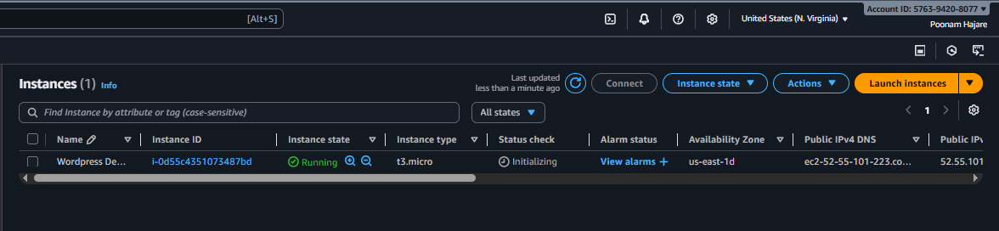
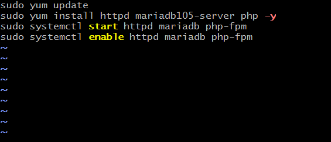
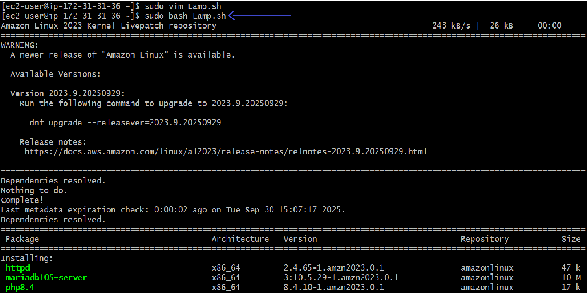
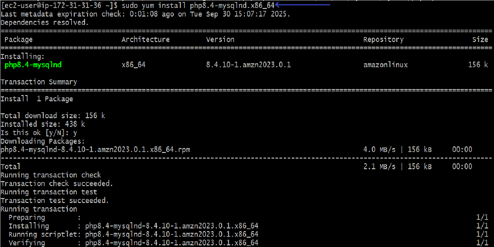
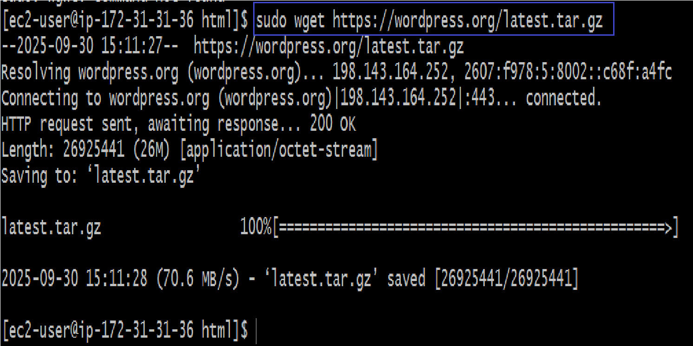
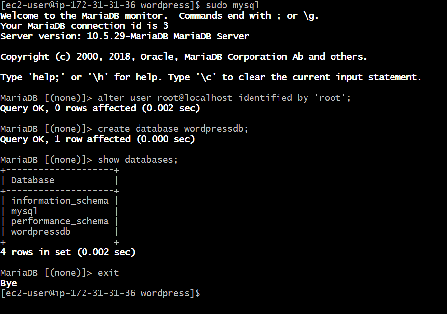
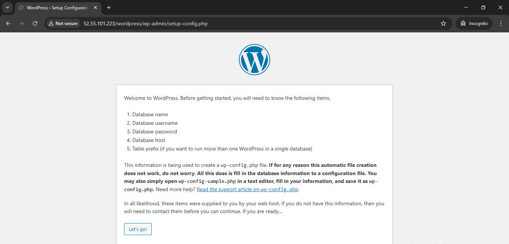
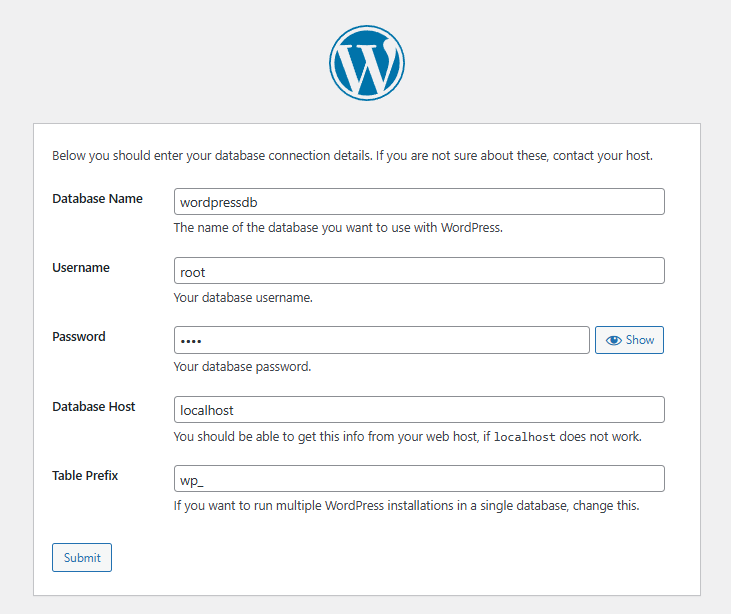
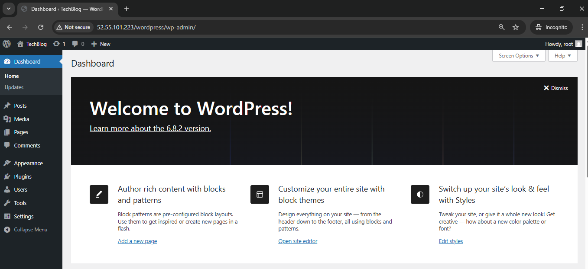
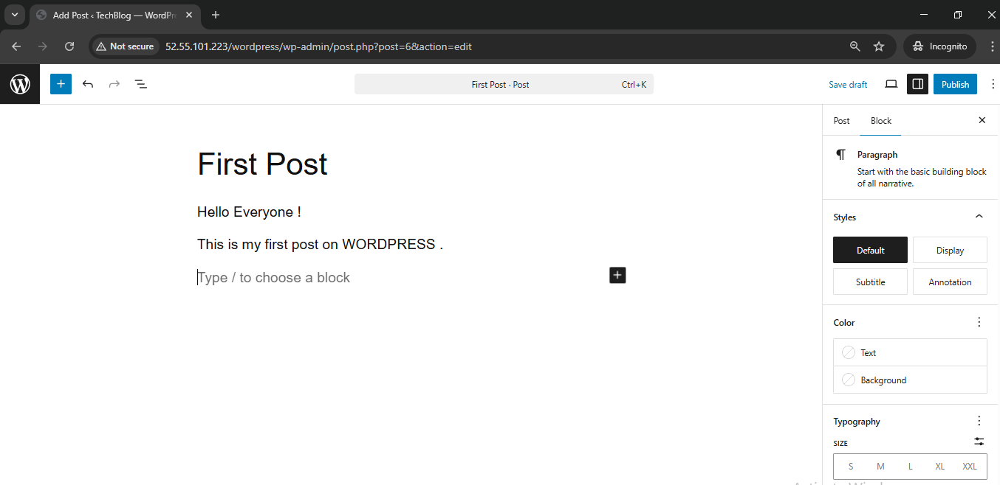

# Deploy WordPress on an EC2 Instance 
---

## Overview 
- This guide shows you how to set up WordPress on an Amazon EC2 instance.
- It uses the LAMP stack (Linux, Apache, MariaDB, PHP), which provides the web server, database, and scripting      language that WordPress needs.

- The steps are written in order and include the exact commands you should run after connecting to your EC2 instance through SSH.
---

## Prerequisites
 1. An **AWS Account** and appropriate permission
 2. A **key pair** (.pem file) for SSH access.     
 3. Security Group inbound rules:
    - SSH (TCP 22) — from your IP.
    - HTTP (TCP 80) — from 0.0.0.0/0.

---
## Steps

### 1. Launch EC2 Instance
- Click **Instances** → then click **Launch Instances**.  
- Name and tags → give name: **Wordpress Deployment**  
- **Choose AMI** → select **Amazon Linux 2 AMI**.  
- Instance type → **t2.micro or t3.micro.**  
- **Key pair** → select or create one (.pem file will be downloaded).   
- **Security group** → allow:
  - SSH (22) → from your IP.
  - HTTP (80) → from 0.0.0.0/0.  
- Click **Launch Instance**.
- You can see now the instance is created successfully.
    
---

### 2. Connect to your EC2 instance
 -  Connect to your EC2 instance using SSH:
      ```bash

      ssh -i "north-v-key2.pem" ec2-user@<PUBLIC_IP>
---
        
### 3. Create a LAMP installation script
 - Instead of running commands one by one, create a script file Lamp.sh.
        ```bash 

        sudo vim Lamp.sh
        
 - Inside the file, press i (insert mode) and add the following commands:
      ```bash 

        sudo yum update
        sudo yum install httpd mariadb105-server php -y
        sudo systemctl start httpd mariadb php-fpm
        sudo systemctl enable httpd mariadb php-fpm
      ```
    

 - Save and exit: 
 - Now run the script:

        sudo bash Lamp.sh

    
- **This will update your system, install Apache, MariaDB, PHP, and enable them at startup.**
---

### 4. Install PHP MySQL connector

 - WordPress needs the PHP MySQL connector.
  
        sudo yum install php8.4-mysqlnd.x86_64
        cd /var/www/html
        ls
    
---

### 5. Download & Extract WordPresss

     sudo wget https://wordpress.org/latest.tar.gz
     ls
 - **wget https://wordpress.org/latest.tar.gz**
         → Downloads the latest version of WordPress as a compressed .tar.gz file.
 - **ls →** 
        Lists all files and directories in the current folder, so you can verify what’s downloaded or    extracted.

     

        sudo tar -xvzf latest.tar.gz
        ls
 -   **tar -xvzf latest.tar.gz →** Extracts the downloaded WordPress archive.
       - **x** → extract files
       - **v** → verbose (shows progress)
       - **z**→ handles gzip compression
       - **f** → specifies the filename
 
        ```bash
        sudo rm -rf latest.tar.gz
        ls
 - **rm -rf latest.tar.gz** → Removes the compressed file after extraction to save space.
  
 - Go inside WordPress: 
  
        cd wordpress/
        ls
---

### 6. Create the WordPress Database

     sudo mysql

- Inside MySQL:

      ALTER USER 'root'@'localhost' IDENTIFIED BY 'root';
      CREATE DATABASE wordpressdb;
      SHOW DATABASES;
      EXIT;
 **Explanation:**
- **sudo mysql →** Opens the MySQL command-line interface as the root user.
- **ALTER USER 'root'@'localhost' IDENTIFIED BY 'root'; →**  Sets or resets the root user password to   root (you can change it to something more secure).
- **CREATE DATABASE wordpressdb; →** Creates a new database named wordpressdb for the WordPress site.
- **SHOW DATABASES; →**  Lists all available databases to confirm that wordpressdb has been created successfully.
- **EXIT; →**   Exits the MySQL prompt and returns to the normal terminal.
    
---

### 7. Change Ownership of WordPress Folder

        cd /var/www/html/
        sudo chown -R apache:apache wordpress
        sudo systemctl restart httpd mariadb php-fpm
 - **sudo chown -R apache:apache wordpress →** Changes the ownership of the wordpress folder (and all its files) to the apache user and group.
   - **chown** → change ownership
   - **-R** → applies changes recursively to all files and subdirectories
   - Ensures Apache can read and write WordPress files properly.
 - **Sudo systemctl restart httpd mariadb php-fpm →** Restarts the necessary services:
---

### 8. Access WordPress Setup in Browser

 - **Go to:**

        http://<PUBLIC_IP>/wordpress
     

---
 - **WordPress Installation Steps:**
 1. Database Configuration:
       -  Database Name: **wordpressdb**
       -  Username: **root**
       -  Password: **root**
       -  Database Host: **localhost**
     
      

 - → Click Submit, then **Run the Installation**.

---
 2. Site Details Setup:
       - Site Title: **TechBlog**
       - Username: **root**
       - Password: **root**
       - Email: **Your-Mail**

 - → Click **Install** WordPress.
---
 3. Login to Dashboard:
      - Username: **root**
      - Password: **root**   

 - → After login, you’ll be redirected to the WordPress Dashboard — **Welcome to WordPress!**
      

---
 4. Next Steps:
 - You can now add new posts, customize your site, and manage plugins/themes from the dashboard.
    

---
## Conclusion
 - Successfully deployed a WordPress site on AWS EC2 using LAMP stack. 
 - This setup provides a basic, scalable foundation for hosting dynamic websites.

---
## Troubleshooting
 - If WordPress page not loading → Check security group (port 80 open)
 - If database error → Verify DB name, username, password
 - Restart services:

        sudo systemctl restart httpd mariadb php-fpm

---
## Future Improvements
 - Use RDS instead of local MariaDB
 - Configure HTTPS using SSL (Let's Encrypt)
 - Add a domain name (Route 53)
 - Automate using Terraform or Ansible


 